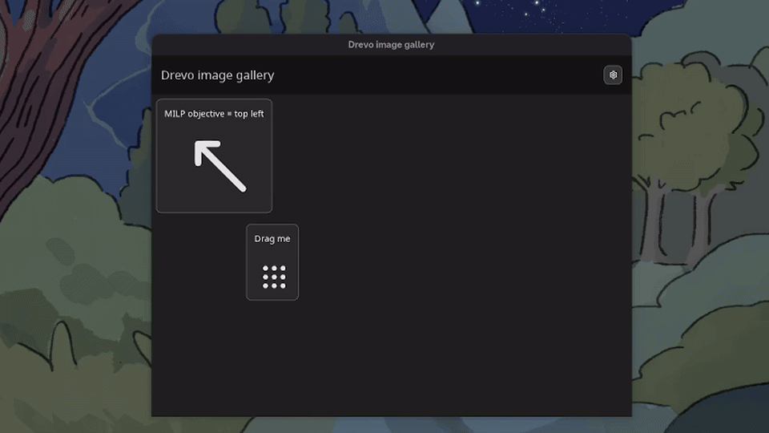
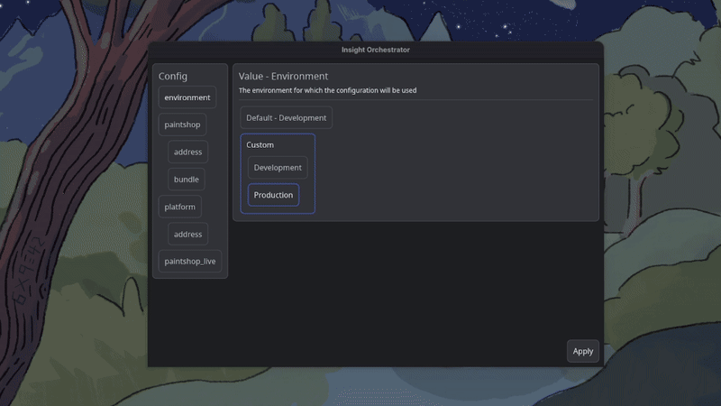

# 
[](https://crates.io/crates/drevo)

Component-based Rust UI framework with state tracking and a MILP constraint layouter.

## Features
- Layout containers for alignment, linear axes, and grids.
- State tracking via `Store<T>` and `State<T>`.
- Constraint-based layout using a Mixed-Integer Linear Programming (MILP) solver.
- Keyboard navigation via `Tab` and `Shift + Tab`.

## Architecture

See [docs/architecture.md](drevo/docs/architecture.md) for details.

- **State tracking**: `Store<T>` tracks the component relayout signals supplied through `.affect()`. Updating a store signals those components.
- **MILP layouter**: Layouting is expressed as linear constraints similar to iOS Auto Layout
- **Tuple layout**: Multi-child containers like `Axis` and `Grid` accept tuples of different widget types through `Into_widgets`.
- **Event routing and focus**: Keyboard and pointer events route through the focus hierarchy. A widget must be interactive to receive clicks.

## Demo

Build tool [PatMat](https://github.com/ElectricPulse/patmat)


Configurator tool showcasing the flexibility of the margins/paddings


## Quick start

Create a new binary crate and add these dependencies:

```toml
[dependencies]
color-eyre = "0.6"
tokio = { version = "1", features = ["macros", "rt-multi-thread"] }
drevo = "0.1.6"
```

Then replace `src/main.rs` with:

```rust
use color_eyre::eyre::Result;
use drevo::{
    geometry::Direction,
    theme,
    widget::widgets::paragraph::Paragraph,
};

#[tokio::main]
async fn main() -> Result<()> {
    color_eyre::install()?;

    let mut paragraph = Paragraph::new(Direction::Horizontal, 320.0);
    paragraph.set_styled_content("Hello from Drevo", theme::dark_theme().specific.text.paragraph);

    drevo::run("Drevo example", paragraph)
}
```

Run it with:

```sh
cargo run
```

`drevo::run` is synchronous because Winit owns the calling thread. The Tokio
runtime remains active for asynchronous widget and background work.

## Documentation
See [docs/index.md](drevo/docs/index.md) for documentation and examples.

## Performance
You might think that the layouter is a huge performance bottleneck, but it easily allows 60FPS for very complex layouts
Compile with `--release` for optimal FPS

## Roadmap
See [docs/roadmap.md](drevo/docs/roadmap.md) for known bugs and planned work.

## Technologies used
- [winit](https://github.com/rust-windowing/winit) for window management
- [vello](https://github.com/linebender/vello) for graphics
