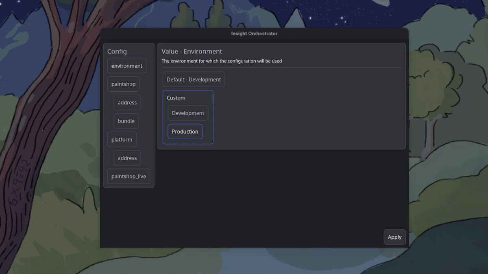

# 

# Vizual

Vizual is a component-based Rust UI framework with state tracking and a MILP constraint layouter.

## Features
- Layout containers for alignment, linear axes, and grids.
- State tracking via `Store<T>` and `State<T>`.
- Constraint-based layout using a Mixed-Integer Linear Programming (MILP) solver.
- Keyboard navigation via `Tab` and `Shift + Tab`.

## Architecture

See [docs/architecture.md](docs/architecture.md) for details.

- **State tracking**: `Store<T>` tracks which widgets read a value. When the value changes, those widgets are scheduled for another layout and render pass.
- **MILP layouter**: Layout rules are expressed as linear constraints and solved with lexicographical priorities.
- **Tuple layout**: Multi-child containers like `Axis` and `Grid` accept tuples of different widget types through `Into_widgets`.
- **Event routing and focus**: Keyboard and click events route through the focus hierarchy. A widget must be interactive to receive clicks.

## Demo


## Quick start

Vizual currently requires a nightly Rust toolchain because it uses
`async_fn_track_caller`.

Create a new binary crate and add these dependencies:

```toml
[dependencies]
color-eyre = "0.6"
tokio = { version = "1", features = ["macros", "rt-multi-thread"] }
vizual = { git = "https://github.com/ElectricPulse/vizual" }
```

Then replace `src/main.rs` with:

```rust
use color_eyre::eyre::Result;
use vizual::{
    geometry::Direction,
    render_manager::Render_manager,
    theme,
    widget::{Widget_trait as _, widgets::paragraph::Paragraph},
};

#[tokio::main]
async fn main() -> Result<()> {
    color_eyre::install()?;

    let render_manager = Render_manager::new();
    let mut paragraph = Paragraph::new(Direction::Horizontal, 320.0);
    paragraph.set_styled_content("Hello from Vizual", theme::dark_theme().specific.text.paragraph);

    vizual::run("Vizual example", paragraph.into_shared(), render_manager)
}
```

Run it with:

```sh
cargo +nightly run
```

`vizual::run` is synchronous because Winit owns the calling thread. The Tokio
runtime remains active for asynchronous widget and background work.

## [Documentation](docs/index.md)

## [Comparison with Iced](docs/comparison.md)

## Pre-release notes
- Currently cargo nightly is required because of ```#[track_caller]``` usage in the database

## [Roadmap](docs/roadmap.md)

See [docs/roadmap.md](docs/roadmap.md) for known bugs and planned work.

## Technologies used
- [winit](https://github.com/rust-windowing/winit) for window management
- [vello](https://github.com/linebender/vello) for graphics
